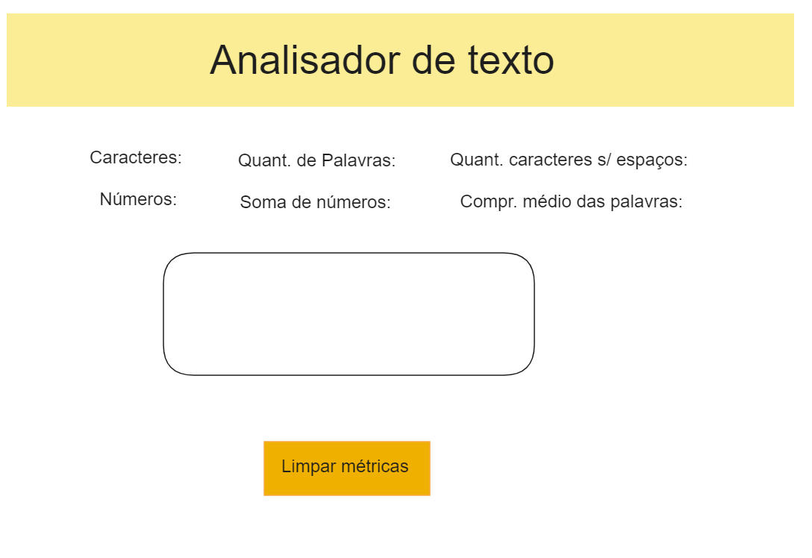

# Analisador de Texto

## Índice

- [1. Preâmbulo](#1-preâmbulo)
- [2. Funcionalidades](#2-funcionalidades)
- [3. Testes](#3-testes)
- [4. Meu processo](#4-processo)

---

## 1. Preâmbulo

_Créditos: Foto de [ethan](https://unsplash.com/fr/@andallthings?utm_source=unsplash&utm_medium=referral&utm_content=creditCopyText)_
_em [Unsplash](https://unsplash.com/es/fotos/72NpWZJOskU?utm_source=unsplash&utm_medium=referral&utm_content=creditCopyText)_

Um analisador de texto é uma aplicação para extrair informações úteis de um
texto utilizando diversas técnicas, como o processamento de linguagem natural
(PLN),aprendizado de máquina (ML) e análise estatística. Essas aplicações podem
fornecer uma variedade de métricas que oferecem informações básicas sobre
o comprimento e a estrutura do texto, como contagem de palavras, contagem de
caracteres, contagem de sentenças e contagem de parágrafos. Outras métricas
incluem análise de sentimentos, que utiliza técnicas de PLN para determinar
o tom geral positivo, negativo ou neutro do texto, e análise de legibilidade,
que utiliza algoritmos para avaliar a complexidade e legibilidade do texto.

Em geral, as aplicações de análise de texto fornecem informações valiosas e métricas
sobre os textos que podem ajudar os usuários a tomar decisões informadas e tirar
conclusões significativas. Por meio do uso dessas ferramentas de análise, os usuários
podem obter uma compreensão mais profunda dos textos.

## 2. Funcionalidades

A lista de funcionalidades é a seguinte:

1. A aplicação deve permitir que a usuária insira um texto escrevendo-o
   em uma caixa de texto.

2. A aplicação deve calcular as seguintes métricas e atualizar o
   resultado em tempo real conforme a usuária escreve o texto:

   - **Contagem de palavras**: a aplicação deve ser capaz de contar o número de
     palavras no texto de entrada e mostrar essa contagem para a usuária.
   - **Contagem de caracteres**: a aplicação deve ser capaz de contar o número de
     caracteres no texto de entrada, incluindo espaços e sinais de
     pontuação, e mostrar essa contagem para a usuária.
   - **Contagem de caracteres excluindo espaços e sinais de pontuação**:
     a aplicação deve ser capaz de contar o número de caracteres no texto de
     entrada, excluindo espaços e sinais de pontuação, e mostrar essa contagem
     para a usuária.
   - **Contagem de números**: a aplicação deve contar quantos números há no
     texto de entrada e mostrar essa contagem para a usuária.
   - **Soma total dos números**: a aplicação deve somar todos os números que
     estão no texto de entrada e mostrar o resultado para a usuária.
   - **Comprimento médio das palavras**: a aplicação deve calcular o
     comprimento médio das palavras no texto de entrada e mostrar esse valor para a usuária.

3. A aplicação deve permitir limpar o conteúdo da caixa de texto ao clicar
   em um botão.

## 3. Testes

Este projeto conta com 3 conjuntos de testes que ajudarão a verificar se
os critérios mínimos de aceitação são cumpridos.

### Testes Unitários

Os testes unitários deste projeto executarão os métodos `getWordCount`,
`getCharacterCount`, `getCharacterCountExcludingSpaces`, `getNumbersCount`,
`getNumbersSum` e `getAverageWordLength` com diferentes argumentos e verificarão
se os valores retornados são os esperados.

Você pode executar esses testes com o comando `npm run test` como mostrado
na imagem a seguir:

### Testes de Critérios Mínimos de Aceitação

Esses testes analisarão seus arquivos
[`index.html`](src/index.html),
[`index.js`](src/index.html),
[`analyzer.js`](src/analyzer.js)
e
[`style.css`](src/style.css)
para verificar se você cumpre os
[critérios mínimos de aceitação](#6-critérios-de-aceitação-mínimos-do-projeto).
Cada critério está relacionado a um objetivo de aprendizado.

Você pode executar todos esses testes com o comando `npm run test:oas`
como mostrado na imagem a seguir:

Você também pode executar os testes de cada grupo de objetivos de aprendizado
individualmente com os seguintes comandos:

- `npm run test:oas-html`
- `npm run test:oas-css`
- `npm run test:oas-web-api`
- `npm run test:oas-js`

#### Testes End-to-End

Você pode executar esses testes com o comando `npm run test:e2e` como mostrado
na imagem a seguir:

## 4. Meu processo

### Protótipo

### Construído com

- Marcação HTML5 semântica
- Propriedades personalizadas de CSS
- Flexbox em CSS

### O que aprendi

- Escrever marcação HTML5 semântica
- Utilizar Flexbox
- Manipulação do DOM em JS
